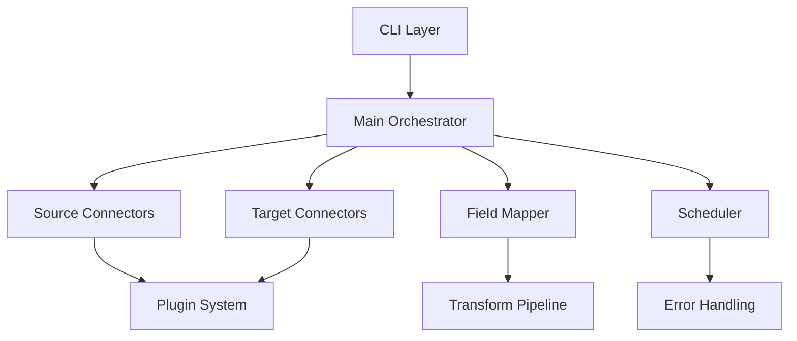

# System Architecture

## High-Level Design

ApiLinker follows a **modular, plugin-based architecture** with clear separation of concerns:



### Core Design Patterns

Real-time event ingestion is supported via webhooks, message queues, and Server-Sent Events (SSE).

1. **Strategy Pattern**: Different connectors, authenticators, and transformers
2. **Factory Pattern**: Plugin instantiation and connector creation
3. **Observer Pattern**: Event handling and monitoring
4. **Circuit Breaker Pattern**: Error handling and recovery
5. **Template Method Pattern**: Base classes with customizable steps

### Package Structure

```
apilinker/
├── __init__.py                 # Main exports and version
├── api_linker.py              # Main orchestrator class
├── cli.py                     # Command-line interface
├── core/                      # Core system components
│   ├── __init__.py
│   ├── connector.py           # Base connector classes
│   ├── mapper.py              # Field mapping and transformations
│   ├── scheduler.py           # Scheduling and automation
│   ├── auth.py                # Authentication system
│   ├── error_handling.py      # Error handling and recovery
│   ├── logger.py              # Logging system
│   ├── plugins.py             # Plugin base classes
│   ├── security.py            # Security features
│   └── security_integration.py # Security integration layer
├── connectors/                # Connector implementations
│   ├── scientific/            # Research/scientific APIs
│   └── general/               # General purpose APIs
├── plugins/                   # Built-in plugins
└── examples/                  # Usage examples
```
